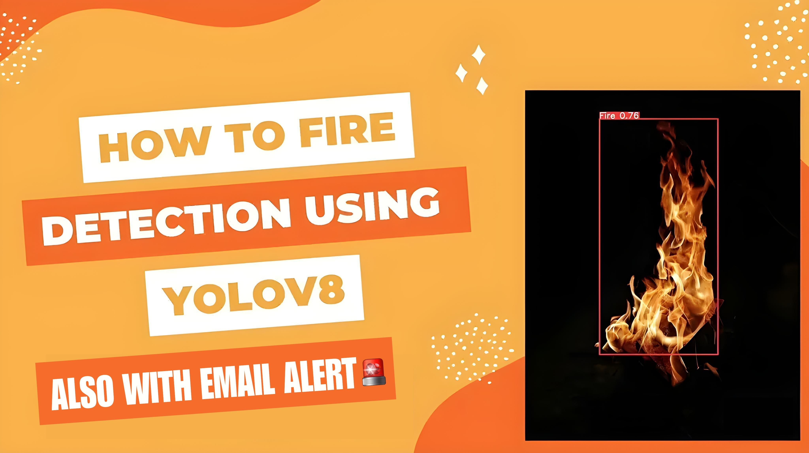

# Fire Detection Using YOLOV8

---

## 

### Fire Detection

The fire detection model leverages the advanced YOLOv8 (You Only Look Once, Version 8) architecture to detect fire in images or video feeds. This system is designed to enhance safety measures by providing real-time fire detection and immediate alert notifications via email.

1. Data gathering and augmentation

   The dataset taken was **"Roboflow"**. It can be downloaded through the link "https://universe.roboflow.com/workshop-yg2yt/fire-uby1d/dataset/1". Image augmentation was performed on this data.

2. Model building

   The model architecture consists of CNN Layer, Max Pooling, Flatten, Bounding Boxes and Dropout Layers.

3. Training

   The model was trained by using variants of above layers mentioned in model building and by varying hyperparameters. The best model was able to achieve 60.1% of validation accuracy.

4. Testing

   The model was tested with sample images. It can be seen below:

   
   
    

#### The model will be able to detect fire :-

## Usage:

### For Fire Detection Code

Refer to the notebook /Fire_detection.ipynb.. 
I have trained an Fire detection model and put its trained weights at /Models

### Train your Fire Detection Model

To train your own fire detection model, Refer to the notebook /fire_detection.ipynb

### For Fire Detection using Webcam

#### Clone the repo:

Run `pip install -r requirements.txt`  
` python fire_detection.ipynb`
